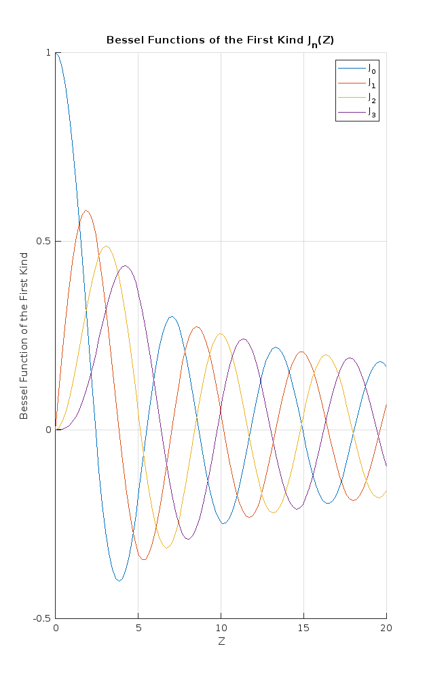

# Jn 
J(n), Bessel functions of the first kind for orders 0, 1, 2, and 3 of cavity resonators.

**Note:** The variables are not **Global**.

The Bessel series can be used to represent a function as a series of Bessel functions. For a function **$f(x)$** defined on the interval **$[0, a]$**, the Bessel series is given by:

**$f(x) = \sum_{n=0}^{\infty} a_n J_n\left(\frac{n\pi x}{a}\right)$**

where:
- **$J_n(z)$** is the [Bessel function of the first kind](https://mathworld.wolfram.com/BesselFunctionoftheFirstKind.html) of order **$n$**. In this context, **$z$** is expressed as **$z = \frac{n\pi x}{a}$**.
- The coefficients **$a_n$** can be calculated using the formula:

**$a_n = \frac{2}{a} \int_0^a f(x) J_n\left(\frac{n\pi x}{a}\right) \, dx$**

This series is particularly useful in solving problems with cylindrical symmetry, such as heat conduction in cylindrical objects or vibrations of circular membranes.

The default definition of the [Bessel function of the first kind](https://mathworld.wolfram.com/BesselFunctionoftheFirstKind.html) of order **$n$**, **$J_n(z)$**, can be expressed in several ways. Here are the most common forms:

1. **Series Representation**:

**$J_n(z) = \sum_{k=0}^{\infty} \frac{(-1)^k}{k! \, \Gamma(n + k + 1)} \left( \frac{z}{2} \right)^{n + 2k}$**

2. **Integral Representation**:

**$J_n(z) = \frac{1}{2\pi} \int_0^{2\pi} e^{i(z \cos \theta - n \theta)} \, d\theta$**

3. **Differential Equation**:
   
   **$J_n(z)$** is a solution to Bessel's differential equation:

**$z^2 \frac{d^2y}{dz^2} + z \frac{dy}{dz} + (z^2 - n^2)y = 0$**

4. **Asymptotic Expansion** (for large **$z$**):
   
**$J_n(z) \sim \sqrt{\frac{2}{\pi z}} \cos\left(z - \frac{n\pi}{2} - \frac{\pi}{4}\right) \quad \text{as } z \to \infty$**

These definitions collectively capture the behavior and properties of Bessel functions in various contexts, including series expansions, integral forms, and differential equations.

[Bessel functions](https://mathworld.wolfram.com/topics/BesselFunctions.html) appear in many areas of physics and engineering due to their role in solving differential equations with cylindrical or spherical symmetry. Here is a list of some of the main applications of Bessel functions in various problems:

### 1. **Electromagnetic Waveguides and Cavities**:
   - **Cylindrical Waveguides**: Bessel functions describe the radial variation of electromagnetic fields in circular waveguides (TE, TM modes).
   - **Cylindrical and Spherical Cavities**: Solutions to the wave equation in cylindrical and spherical geometries involve Bessel and spherical Bessel functions, determining the resonant frequencies and field patterns.
   - **Optical Fibers**: Bessel functions describe the modal patterns of light propagating through cylindrical optical fibers.

### 2. **Vibration of Circular Membranes**:
   - **Drumhead Problem**: The vibration modes of a circular drumhead (membrane) are governed by the Helmholtz equation, which leads to solutions in terms of Bessel functions.
   - **Timpani and Membranes**: Bessel functions model the natural frequencies of sound waves in drums and other circular membrane-based instruments.

### 3. **Diffraction and Optics**:
   - **Fraunhofer Diffraction from Circular Apertures**: The diffraction pattern of light passing through a circular aperture is described by Bessel functions.
   - **Optical Lenses and Gaussian Beams**: Bessel functions are used in describing the propagation of Gaussian laser beams, particularly Bessel beams, which exhibit non-diffracting behavior.
   - **Acoustic Diffraction**: In acoustics, Bessel functions describe the diffraction of sound waves through circular or spherical openings.

### 4. **Heat Conduction**:
   - **Cylindrical and Spherical Geometries**: Heat conduction problems in cylindrical or spherical geometries lead to solutions involving Bessel functions when solving the heat equation.

### 5. **Quantum Mechanics**:
   - **Quantum Wells and Dots**: In quantum mechanics, when dealing with problems involving cylindrical or spherical potentials (e.g., in quantum wells or dots), Bessel functions describe the wavefunctions of particles.
   - **Hydrogen Atom in Cylindrical Coordinates**: Bessel functions arise in the solution to Schrödinger’s equation for systems with cylindrical or spherical symmetry.

### 6. **Fluid Dynamics**:
   - **Stokes Flow around Cylinders**: In problems involving slow viscous flow around cylindrical objects (e.g., in pipes or around fibers), Bessel functions appear in the solution to the Navier-Stokes equation.
   - **Boundary Layer Theory**: In fluid dynamics, Bessel functions describe the flow around cylindrical or spherical obstacles.

### 7. **Electrostatics and Magnetostatics**:
   - **Cylindrical and Spherical Capacitors**: Bessel functions help solve Laplace’s equation in cylindrical or spherical coordinates for the electric potential in these geometries.
   - **Magnetic Vector Potential**: In problems involving magnetic vector potential in cylindrical geometries, such as coaxial cables or solenoids, Bessel functions are used.

### 8. **Acoustics**:
   - **Sound Waves in Circular Ducts**: Bessel functions describe the propagation of sound waves in circular ducts, pipes, or tubes.
   - **Loudspeaker Design**: Bessel functions are involved in modeling the behavior of sound waves emitted by circular loudspeakers or arrays.

### 9. **Antenna Theory**:
   - **Cylindrical Antennas**: Bessel functions describe the current distribution and radiated fields of cylindrical antennas (such as dipole or monopole antennas).
   - **Radiation Patterns**: The far-field radiation patterns of circular apertures or parabolic antennas can involve Bessel functions.

### 10. **Signal Processing**:
   - **Bessel Filters**: In signal processing, Bessel functions are used to design Bessel filters, which have a maximally flat group delay and are used in applications requiring minimal signal distortion.

### 11. **Electromagnetic Scattering**:
   - **Mie Scattering**: Bessel functions are key in Mie theory, which describes the scattering of electromagnetic waves by spherical particles (e.g., rain droplets or aerosols).
   - **Radar Cross-Section**: In radar and other scattering problems, Bessel functions describe the scattered fields from spherical or cylindrical objects.

### 12. **Hydrodynamics and Oceanography**:
   - **Water Waves**: In fluid mechanics and oceanography, Bessel functions are used to model wave propagation in circular and cylindrical basins.
   - **Tsunami Waves**: The long-range propagation of tsunami waves in circular basins or around islands can be modeled using Bessel functions.

### 13. **Elasticity and Mechanical Engineering**:
   - **Torsional Vibrations**: Bessel functions describe the torsional modes of vibration in cylindrical shafts.
   - **Stress and Strain in Cylindrical Objects**: In mechanical engineering, Bessel functions are used to model stress and strain distribution in cylindrical structures under various loading conditions.

### 14. **Medical Imaging**:
   - **Ultrasound Imaging**: Bessel functions are used in the analysis of sound waves in circular transducers and other ultrasound-based imaging devices.
   - **MRI (Magnetic Resonance Imaging)**: In MRI, Bessel functions describe the signal behavior in circular and spherical regions of interest.

### 15. **Electrochemical Cells**:
   - **Battery Design**: In the design of cylindrical batteries, Bessel functions model the distribution of electric potential and current in the cell structure.

[Bessel functions](https://mathworld.wolfram.com/topics/BesselFunctions.html) are invaluable in problems with circular or cylindrical symmetry, providing solutions to differential equations that arise in a wide range of fields, including electromagnetism, acoustics, fluid dynamics, and quantum mechanics.

## Cavity Resonators

**Transverse Electric (TE) and Transverse Magnetic (TM) Modes**: 
- **TE Modes**: In TE modes, the electric field is perpendicular to the direction of wave propagation, while the magnetic field has a component in the propagation direction.
- **TM Modes**: In transverse magnetic (TM) modes, the magnetic field is perpendicular to the direction of wave propagation, and the electric field has a component in the propagation direction.

In both cases, the specific calculations involving Bessel functions may be required depending on the resonator's geometry and the mode being analyzed.

### Dominant Frequency in Cavity Resonators

The lowest possible frequency in a cavity is referred to as the **dominant mode**. This is the resonant frequency associated with the lowest mode number, and for a cylindrical cavity, it typically corresponds to the **$TE_{11}$** or **$TM_{01}$** mode, depending on the type of cavity and the boundary conditions.

The dominant mode has the smallest possible value of the wavenumbers **$m, n, p$**, which minimizes the resonant frequency **$f_{mnp}$** given by:

**$f_{mnp,TE} = \frac{c}{2\pi} \sqrt{\left( \frac{x'_{mn}}{a} \right)^2 + \left( \frac{p\pi}{h} \right)^2}$**

**$f_{mnp,TM} = \frac{c}{2\pi} \sqrt{\left( \frac{x_{mn}}{a} \right)^2 + \left( \frac{p\pi}{h} \right)^2}$**

For example, in a **TE mode** cylindrical cavity, the **$TE_{11}$** mode (with **$m=1$**, **$n=1$**, and **$p=0$**) typically gives the lowest frequency. Similarly, in **TM mode**, the **$TM_{01}$** mode is often dominant. 

Thus, the dominant mode represents the fundamental resonant frequency of the cavity and determines its lowest operating frequency.

#### Rectangular Resonator Cavities

In rectangular cavities, the dominant mode is typically the **$TE_{10}$** mode, which has a frequency given by:

**$f_{10} = \frac{c}{2} \sqrt{\left(\frac{m}{a}\right)^2 + \left(\frac{n}{b}\right)^2}$**

where:
- **$c$** is the speed of light,
- **$a$** and **$b$** are the dimensions of the cavity,
- **$m$** and **$n$** are the mode numbers in the **$x$** and **$y$** directions.

#### Spherical Resonator Cavities

In spherical cavities, the modes are classified into **spherical harmonics**, and the dominant mode is typically the **$l=1$** mode, with frequencies determined by:

**$f_{lmn} = \frac{c}{2\pi} \sqrt{\left(\frac{x_{l}}{R}\right)^2 + \left(\frac{m\pi}{R}\right)^2 + \left(\frac{n\pi}{R}\right)^2}$**

where:
- **$R$** is the radius of the sphere,
- **$l, m, n$** are the mode numbers related to the angular distribution.

The **$l=1$** mode corresponds to the fundamental oscillation in the spherical cavity, leading to lower frequencies compared to higher order modes.

### Cylindrical cavity 

The resonant frequencies of modes in a cylindrical cavity resonator are often denoted by the notation **$f_{mnp}$**, where **$m$**, **$n$**, and **$p$** represent the mode indices. Here's how these indices correspond to different modes and the equations used to calculate the frequencies.

### Resonant Frequencies in a Cylindrical Cavity

For cylindrical cavity resonators, the modes are characterized as follows:

- **$m$**: Azimuthal mode number (number of full rotations around the axis).
- **$n$**: Radial mode number (number of radial nodes).
- **$p$**: Axial mode number (number of half-wavelengths along the height of the cylinder).

### Frequency Calculation

The general formula for the resonant frequencies **$f_{mnp}$** in a cylindrical cavity resonator can be expressed as:

**$f_{mnp} = \frac{c}{2\pi} \sqrt{\left( \frac{x_{mn}}{a} \right)^2 + \left( \frac{p\pi}{h} \right)^2}$**

Where:
- **$c$** is the speed of light in vacuum (**$3 \times 10^8 \, \text{m/s}$**).
- **$a$** is the radius of the cylindrical cavity.
- **$h$** is the height of the cylindrical cavity.
- **$x_{mn}$** is the **$n$**-th [root](https://mathworld.wolfram.com/BesselFunctionZeros.html) of the Bessel function **$J_m(x)$**. For example, the first root of **$J_m(x)$** corresponds to the radial mode number **$n$**.

### TE Modes

1. **TE Modes**: For TE modes, the frequency formula can be derived from the boundary conditions and the Bessel functions that describe the fields. The resonant frequency for the TE mode can be calculated using:
   **$f_{mnp} = \frac{c}{2\pi} \sqrt{\left( \frac{x'_{mn}}{a} \right)^2 + \left( \frac{p\pi}{h} \right)^2}$**

### TM Modes

2. **TM Modes**: Similarly, for TM modes, the electric field has a component along the direction of propagation, and the resonant frequencies are given by:
   **$f_{mnp} = \frac{c}{2\pi} \sqrt{\left( \frac{x_{mn}}{a} \right)^2 + \left( \frac{p\pi}{h} \right)^2}$**

### Derivation of Resonant Frequency Equations in a Cylindrical Cavity with Bessel Series

The resonant frequencies of a cylindrical cavity can be derived from the solutions of Maxwell's equations in cylindrical coordinates, subject to boundary conditions. Let’s go through the steps for TE and TM modes, including Bessel function solutions.

#### Step 1: Helmholtz Equation in Cylindrical Coordinates
The wave equation in cylindrical coordinates **$r, \phi, z$** for the electric or magnetic field **$E$** or **$H$** is:

**$\nabla^2 \mathbf{E} + k^2 \mathbf{E} = 0$** 

Expanding in cylindrical coordinates for the radial part **$E_r$**:

**$\frac{1}{r} \frac{\partial}{\partial r} \left( r \frac{\partial E_r}{\partial r} \right) + \frac{1}{r^2} \frac{\partial^2 E_r}{\partial \phi^2} + \frac{\partial^2 E_r}{\partial z^2} + k^2 E_r = 0$**

Assuming separation of variables **$E_r(r, \phi, z) = R(r)\Phi(\phi)Z(z)$**, we separate the equation into three parts.

#### Step 2: Azimuthal and Axial Solutions
For the **$\phi$** dependence, we get:

**$\frac{d^2 \Phi}{d \phi^2} + m^2 \Phi = 0$** 

The solution is:

**$\Phi(\phi) = e^{im\phi}$**, 

where **$m$** is the azimuthal mode number.

For the **$z$** dependence, we have:

**$\frac{d^2 Z}{d z^2} + \left( \frac{p\pi}{h} \right)^2 Z = 0$** 

The solution is:

**$Z(z) = \sin\left( \frac{p\pi z}{h} \right)$** 

where **$p$** is the axial mode number, and **$h$** is the cavity height.

#### Step 3: Radial Solution (Bessel's Equation)
The radial equation becomes a Bessel differential equation:

**$\frac{d}{dr} \left( r \frac{dR}{dr} \right) + \left( k_r^2 r - \frac{m^2}{r} \right) R = 0$**

The solution to this equation is given by Bessel functions:

**$R(r) = J_m(k_r r)$**, 

where **$J_m$** is the [Bessel function of the first kind](https://mathworld.wolfram.com/BesselFunctionoftheFirstKind.html), and **$k_r$** is the radial wavenumber.

#### Step 4: Bessel Series Formulas
[Bessel function of the first kind](https://mathworld.wolfram.com/BesselFunctionoftheFirstKind.html) **$J_m(x)$** can be expressed as a series:

**$J_m(x) = \sum_{i=0}^{\infty} \frac{(-1)^i}{i! \Gamma(i + m + 1)} \left( \frac{x}{2} \right)^{2i+m}$**

Where:
- **$m$** is the order of the Bessel function,
- **$\Gamma(i + m + 1)$** is the Gamma function.

The zeros of the Bessel function **$J_m(x)$** are important for determining the resonant frequencies. Denoting the **$n$**-th zero of **$J_m(x)$** as **$x_{mn}$**, we have:

**$J_m(x_{mn}) = 0$**.

#### Step 5: Applying Boundary Conditions
At the boundary **$r = a$** (cavity radius), the electric or magnetic field must satisfy the boundary condition **$E_r(a) = 0$** or **$H_r(a) = 0$**. This leads to the condition:

**$J_m(k_r a) = 0$**

The values of **$k_r a$** correspond to the roots **$x_{mn}$** of the Bessel function **$J_m(x)$**. Thus:

**$k_r = \frac{x_{mn}}{a}$**, 

where **$x_{mn}$** is the **$n$**-th root of **$J_m(x)$**.

#### Step 6: Resonant Frequency
The total wavenumber **$k$** is related to the frequency **$f$** by:

**$k^2 = k_r^2 + \left( \frac{p\pi}{h} \right)^2$**

Substituting **$k_r = \frac{x_{mn}}{a}$** into this expression:

**$k = \sqrt{\left( \frac{x_{mn}}{a} \right)^2 + \left( \frac{p\pi}{h} \right)^2}$**

Since **$k = \frac{2\pi f}{c}$**, the resonant frequency **$f_{mnp}$** is:

**$f_{mnp} = \frac{c}{2\pi} \sqrt{\left( \frac{x_{mn}}{a} \right)^2 + \left( \frac{p\pi}{h} \right)^2}$**

where **$c$** is the speed of light.

#### Final Resonant Frequency Equations

- **TE Modes**: 

  **$f_{mnp} = \frac{c}{2\pi} \sqrt{\left( \frac{x'_{mn}}{a} \right)^2 + \left( \frac{p\pi}{h} \right)^2}$**

- **TM Modes**:

  **$f_{mnp} = \frac{c}{2\pi} \sqrt{\left( \frac{x_{mn}}{a} \right)^2 + \left( \frac{p\pi}{h} \right)^2}$**

Where **$x_{mn}$** is the **$n$**-th [root](https://mathworld.wolfram.com/BesselFunctionZeros.html) of the Bessel function **$J_m(x)$**. and **$x'_{mn}$** is the **$n$**-th [root](https://mathworld.wolfram.com/BesselFunctionZeros.html) of the prime version of Bessel function **$J'_m(x)$** = **$\frac{J_{m-1}(x) - J_{m+1}(x)}{2}$**.

### MATLAB 
In MATLAB, the Bessel function of the first kind can be computed using the [`besselj`](https://www.mathworks.com/help/matlab/ref/besselj.html) function. Here's the general syntax and an example of how to use it:

#### Syntax
```matlab
Y = besselj(nu, Z)
```
- `nu` is the order of the Bessel function (can be a scalar or a vector).
- `Z` is the input value or array at which to evaluate the Bessel function.

#### Example
Here’s an example of how to plot the Bessel function of the first kind for different orders:

```matlab
% Define the range of values for Z
Z = linspace(0, 20, 100);  % Z values from 0 to 20

% Define orders of the Bessel function
orders = [0, 1, 2, 3];

% Create a figure
figure;
hold on;

% Plot Bessel functions for each order
for nu = orders
    Y = besselj(nu, Z);
    plot(Z, Y, 'DisplayName', ['J_' num2str(nu)]);
end

% Add labels and legend
xlabel('Z');
ylabel('Bessel Function of the First Kind');
title('Bessel Functions of the First Kind J_n(Z)');
legend show;
grid on;
hold off;
```

#### Explanation

- `linspace(0, 20, 100)` generates 100 points between 0 and 20.
- The loop iterates over the specified orders (`0`, `1`, `2`, `3`) and calculates the Bessel function values for those orders.
- The `plot` function visualizes the results, with a legend indicating the order of the Bessel functions.

You can modify the range of `Z` and the orders as needed for your specific application.

#### Functions Derivation 
MATLAB does not have built-in functions for the prime version of the Bessel function of the first kind (denoted as **$\( J_n'(z) \)$**) or for computing the zeros of Bessel functions directly. Functions derivation by user is not recommend because user-defined functions for manual derivation often are incomplete . Anyway, While MATLAB provides the [`besselj`](https://www.mathworks.com/help/matlab/ref/besselj.html) function to calculate the Bessel function values, users need to manually derive the derivatives or use numerical methods to find the zeros, often leveraging root-finding techniques like `fzero`:

```
% Define the order of the Bessel function
n = 0;  % Change this to the desired order

% Number of zeros to find
num_zeros = 5;

% Preallocate an array for zeros
bessel_zeros = zeros(1, num_zeros);

% Initial guesses for the zeros (can be adjusted)
initial_guesses = (1:num_zeros) * pi;  % Initial guesses for the first few zeros

% Find zeros using fzero
for k = 1:num_zeros
    bessel_zeros(k) = fzero(@(z) besselj(n, z), initial_guesses(k));
end

% Display the results
disp('Zeros of Bessel function of the first kind:');
disp(bessel_zeros);
```

### Python 
In Python, the `scipy.special` module provides several functions to work with Bessel functions and their properties. Here’s a detailed explanation of some key functions for handling Bessel functions of the first kind and their derivatives:

- **`scipy.special.jv(nu, z)`**:  
  This function calculates the Bessel function of the first kind, denoted as **$J_{\nu}(z)$**, where **$\nu$** is the order and **$z$** is the argument. Bessel functions of the first kind are solutions to Bessel's differential equation that are finite at the origin (for non-negative integer orders). You can pass any real or complex value for **$\nu$** (the order) and **$z$** (the argument).

  **Example**:  
  ```python
  from scipy.special import jv
  result = jv(2, 3.0)  # Calculates J_2(3.0)
  ```

- **`scipy.special.jvp(nu, z)`**:  
  This function returns the derivative of the Bessel function of the first kind with respect to **$z$**, denoted as **$J'_{\nu}(z)$**. This is useful when you need to compute the slope or rate of change of the Bessel function at a particular point.

  **Example**:  
  ```python
  from scipy.special import jvp
  result = jvp(2, 3.0)  # Calculates J'_2(3.0)
  ```

- **`scipy.special.jn_zeros(nu, n)`**:  
  This function returns the first **$n$** zeros of the Bessel function of the first kind of integer order **$\nu$**. Zeros are the points where the Bessel function evaluates to zero, which are important in many applications such as solving boundary value problems in cylindrical coordinates.

  **Example**:  
  ```python
  from scipy.special import jn_zeros
  zeros = jn_zeros(2, 5)  # Finds the first 5 zeros of J_2
  ```

- **`scipy.special.jnp_zeros(nu, n)`**:  
  This function returns the first **$n$** zeros of the derivative of the Bessel function of the first kind, **$J'_{\nu}(z)$**, when **$\nu$** is an integer. These zeros are useful in problems that involve the roots of the derivative of the Bessel function, such as finding modes in waveguides.

  **Example**:  
  ```python
  from scipy.special import jnp_zeros
  prime_zeros = jnp_zeros(2, 5)  # Finds the first 5 zeros of J'_2
  ```

These functions are helpful when solving physical problems involving cylindrical or spherical symmetry, like vibrations of a circular membrane, or when analyzing wave propagation in cylindrical coordinates.

In this repository, the Python code is used to calculate the resonance frequency of cavities.
